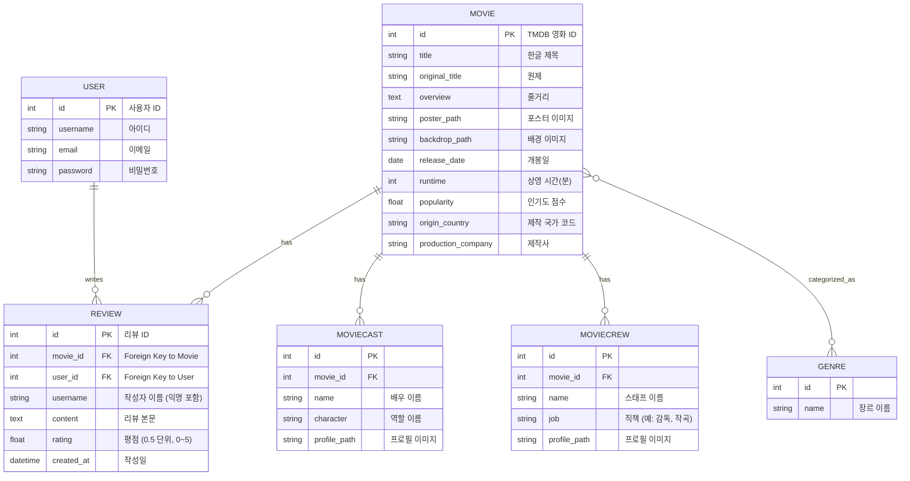

# 🎬 오픈소스 8조

Django 기반 영화 리뷰 웹 애플리케이션입니다.

**팀원**: 심혁, 김진환, 이재원, 허승우  

---

## 🚀 Getting started

> 이 프로젝트는 Python 패키지 매니저로 [`uv`](https://github.com/astral-sh/uv)를 사용합니다. `uv`는 ultra-fast 설치 속도와 캐싱을 제공하며, `pip`과 `virtualenv`를 대체합니다.

### 1. uv 설치

[공식문서](https://docs.astral.sh/uv/getting-started/installation/)를 참고해주세요.

### 2. Project Clone
```bash
$ git clone https://github.com/Johncakes/Open_Source_Group_8.git
$ cd Open_Source_Group_8
```

### 3. Database Migration
```bash
$ uv run python manage.py migrate
```

### 4. 영화 데이터 Import
```bash
$ uv run python movie/scripts/import_genres.py
$ uv run python movie/scripts/import_movies.py
```

## ⚙️ 개발 서버 실행

### 1. 📝 환경변수 설정
`.env.sample` 을 참고하여 `.env` 를 생성합니다.

### 2. 개발 서버 실행
```bash
$ uv run python manage.py runserver
```

## 🗂 ERD
